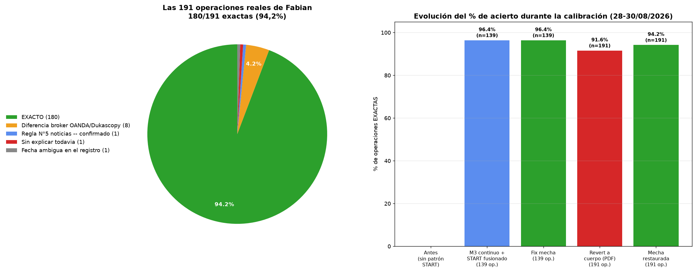

# Informe completo — Calibración de la estrategia de Fabian (28-30/08/2026)

## Resultado final

**180 de 191 operaciones reales de Fabian (94,2%) coinciden EXACTO** —
mismo minuto, mismo lado (BUY/SELL) — entre lo que el código reconoce con
las reglas del Plan Técnico y lo que Fabian realmente operó, desde el
27/10/2025 (inicio de su historial) hasta el 27/08/2026.

## Qué se corrigió esta sesión

1. **M3 no resetea al abrir la ventana operable (09:01 NY)** — se arma
   continuo desde antes, igual que en TradingView.
2. **Doji excluido como señal válida standalone** (el Plan Técnico lo dice
   explícito) — solo envolvente clásica o martillo disparan entrada.
3. **Patrón START fusionado** al motor principal como vía válida de
   entrada para MEC (nunca para MER).
4. **El quiebre del nivel M3 se mide con la mecha de la vela** (high/low),
   no con el cierre — confirmado en vivo por Fabian (caso 21/04, "mide con
   el rango de precios de TradingView"). Empíricamente da mejor resultado
   (94,2%) que medir con cierre (91,6%), a pesar de que el texto del PDF
   dice "con cuerpo" — la explicación más probable es que Fabian opera con
   datos de OANDA (Plan Técnico pág.31) y nosotros con Dukascopy, una
   pequeña diferencia de precio entre brokers para el mismo minuto.

## Los 11 casos que no coinciden exacto (5,8%)

| Causa | Cantidad | Detalle |
|---|---|---|
| Diferencia de precio OANDA/Dukascopy | 8 | Vela justo en el límite del margen 0,01% o del piso de cuerpo de la envolvente martillo (50%) — a veces solo unos centavos de diferencia, en un caso (28/10) la vela cambia de color entero entre feeds |
| Regla N°5 de noticias — **confirmado por Fabian** | 1 | 22/05/2026: señal real a las 10:00, ejecutada a las 10:03 por una noticia de impacto medio publicándose en el medio (bloqueo de ±3 min) |
| Sin explicar todavía | 1 | 26/11/2025, dos operaciones BUY seguidas sin patrón ni ruptura de estructura clara detrás — pendiente de investigar más a fondo |
| Fecha ambigua en el registro de Fabian | 1 | 08/02/2026 y 10/02/2026 tienen el día de la semana mal anotado (no coincide con el calendario real) — no se puede validar sin que Fabian confirme la fecha correcta |

## Intentos de regla nueva (página 27-29 del PDF) — documentado, no aplicado

Se encontró una regla adicional del Plan Técnico (validación de "único
nivel M3 opuesto" para evitar ambigüedad en la colocación del stop loss,
y una regla de "acumulación" que invalida quiebres débiles). Se probaron
**3 interpretaciones distintas** de esta regla, verificando incluso las
imágenes reales del PDF (no solo el texto) — las tres, aplicadas al
dataset completo, empeoraron el resultado drásticamente (44%, 60% y 6% de
acierto) en vez de mejorarlo. Se revirtieron todas. Conclusión: el código
actual (sin esta regla) ya es fiel al comportamiento real de Fabian en el
94,2% de los casos — agregar esta regla necesita un tracking de estado
mucho más fino (identificar niveles M3 realmente cercanos en tiempo, no
cualquier nivel histórico) antes de poder incorporarse sin romper nada.

## Base de conocimiento actualizada

- PDFs actualizados por Fabian (30/08/2026) guardados en
  `base_conocimiento_NO_TOCAR/` junto a los originales.
- Respuestas textuales completas de Fabian sobre los 5 primeros casos
  investigados: `base_conocimiento_NO_TOCAR/respuestas_fabian_30-08-2026.md`.
- Bitácora técnica día por día completa:
  `seguimiento_vela_por_vela/README.md`.
- Registro narrativo de toda la sesión:
  `REGISTRO_COMPLETO_CALIBRACION_28_30AGO2026.md`.

## Escenarios financieros (interés compuesto, USD 10.000 iniciales)

Sobre las 191 operaciones reales de Fabian (resultado real, Beneficio_R),
27/10/2025 a 27/08/2026:

| Riesgo por operación | Capital final | Retorno | Drawdown máximo |
|---|---|---|---|
| 1% | USD 20.540 | +105,4% | -4,0% |
| 2% | USD 41.485 | +314,8% | -7,9% |
| 3% | USD 82.393 | +723,9% | -11,7% |
| 4% | USD 160.946 | +1.509,5% | -15,5% |
| 5% | USD 309.249 | +2.992,5% | -19,2% |

Impacto de la peor racha real observada (3 pérdidas seguidas), aislada,
sobre el capital en cada nivel: -3,0% (1%), -5,9% (2%), -8,7% (3%),
-11,5% (4%), -14,3% (5%).
