# Informe — Escalera de Riesgo, Martingala y Anti-Martingala

**Fecha:** 04/09/2026
**Para:** Fabian
**Contexto:** Fabian propuso una "escalera de riesgo" (Martingala clásica: duplicar el riesgo tras cada pérdida) como posible gestión de capital. Este informe documenta el testeo completo de esa idea contra los datos reales de las 482 operaciones (NY + Pre-NY + Asia, 27/10/2025 → 02/09/2026), más todas las alternativas que fuimos armando hasta encontrar la de mejor relación riesgo/beneficio.

---

## 0. Resumen ejecutivo

La Martingala que propuso Fabian (duplicar tras cada pérdida) **se probó a fondo y se descarta**: tiene una probabilidad real y medible de perder el 100% del capital (hasta 26,9% de probabilidad en el perfil más agresivo), porque apuesta más justo cuando el mercado ya viene en contra. En el camino, probamos su contraparte — el **Anti-Martingala** (escalar en rachas ganadoras, no perdedoras) — y de ahí surgió una variante propia, **"2 confirmaciones + incremento lineal"**, que terminó siendo la mejor combinación de retorno y control de riesgo de todo lo que analizamos en esta sesión. Este informe muestra el camino completo, con los números y gráficos de cada paso, y cierra con esa estrategia aplicada a base 3% y 5%.

---

## 1. La propuesta original de Fabian — la Martingala ("escalera de riesgo")

**Regla**: si ganás, arriesgás el riesgo base. Si perdés, el próximo trade duplicás el riesgo. Apenas ganás, resetea de golpe a la base. 4 perfiles con 5 niveles cada uno (Conservador 0,25-4%, Moderado 0,5-8%, Arriesgado 1-16%, Muy arriesgado 2-32%).

### Backtest con la historia real (los 4 perfiles sobrevivieron, una sola racha de 4 pérdidas)

| Perfil | Capital final (USD 1.000) | Retorno | Drawdown |
|---|---|---|---|
| Conservador | USD 2.223 | +122,3% | -3,2% |
| Moderado | USD 4.878 | +387,8% | -6,3% |
| Arriesgado | USD 22.623 | +2.162,3% | -12,3% |
| Muy arriesgado | USD 421.625 | +42.062,5% | -23,8% |

### La pregunta real: ¿qué pasa con una racha que todavía no viste?

Bootstrap (5.000 universos), dejando que la escalera duplique SIN techo (como describe la regla, "y así sucesivamente"):

| Perfil | Probabilidad de perder TODO el capital |
|---|---|
| Conservador | 0,8% |
| Moderado | 3,2% |
| Arriesgado | 10,3% |
| **Muy arriesgado** | **26,9%** |

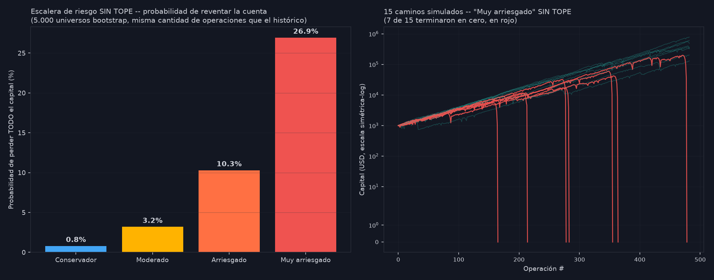

### Nivel por nivel — ¿dónde empieza el peligro?

| Racha de pérdidas | Probabilidad de que pase |
|---|---|
| 4 seguidas | 96,2% (ya pasó una vez) |
| **5 seguidas** | **63,9% — más probable que no** |
| 6 seguidas | 26,9% |
| 7 seguidas | 9,5% |

En el nivel 5 (que la mayoría de las veces SÍ se alcanza), el perfil Arriesgado ya perdió 25% del capital y el Muy arriesgado casi la mitad (54,3% restante) — el "tope" evita la ruina matemática exacta, pero no evita el daño severo, que además es frecuente, no raro.

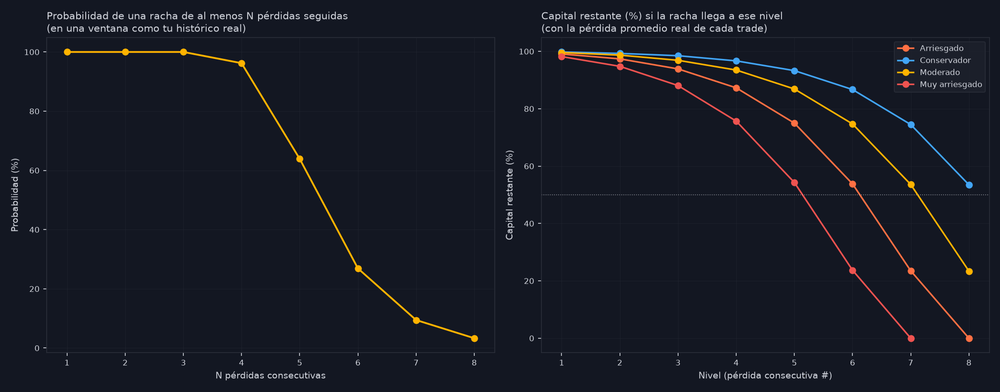

**Conclusión de este tramo: la Martingala, con o sin techo, no es una gestión de riesgo recomendable — el momento en que más se arriesga es exactamente el momento en que estadísticamente peor viene la racha.**

---

## 2. La alternativa — Anti-Martingala (escalar en rachas GANADORAS)

Mismos 4 perfiles, misma lógica pero invertida: se sube el riesgo tras ganar, se resetea a base ante cualquier pérdida.

| Perfil | Retorno real | Drawdown real | P(perder todo) |
|---|---|---|---|
| Conservador | +625,3% | -7,6% | **0%** |
| Moderado | +4.436,0% | -15,1% | **0%** |
| Arriesgado | +114.469,5% | -30,0% | **0%** |
| Muy arriesgado | +12.500.201,7% | -57,2% | **0%** |

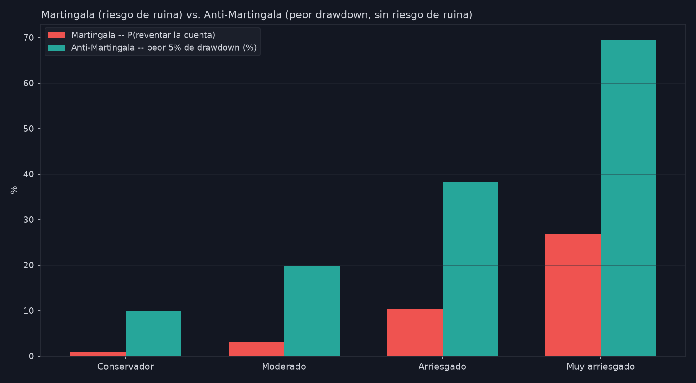

**0% de riesgo de ruina** porque nunca compone riesgo DENTRO de una racha perdedora — una pérdida siempre cuesta un monto acotado. Pero ojo: en bases de riesgo más altas (probado después, sección 4), esto deja de ser tan seguro.

---

## 3. Comparación de las 3 familias en la grilla completa (1%-5% de riesgo base)

| Base | Parejo (sin escalera) | Martingala (con techo) | Anti-Martingala clásico |
|---|---|---|---|
| 1% | +437,0% / -4,5% | +2.162,3% / -12,3% | +114.469,5% / -30,0% |
| **3%** | +13.536,3% / -13,1% | +655.146,6% / -34,4% | +100.378.900,2% / -80,3% |
| 5% | +292.663,7% / -21,3% | +94.667.444,1% / -53,3% | +9.836,2% / -99,9% |

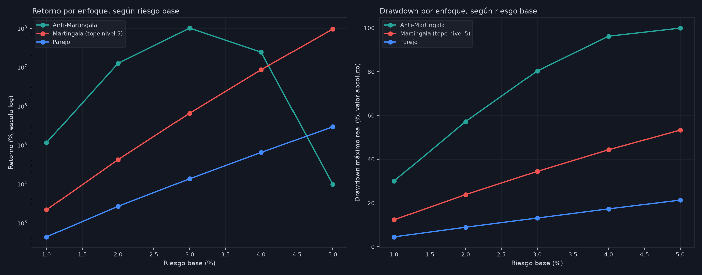

**Hallazgo importante que corrigió nuestra primera impresión**: a partir de 2% de base, el Anti-Martingala clásico TAMBIÉN desarrolla una cola de riesgo severa (drawdown de -57% a -99,9%) — no por ruina matemática instantánea, sino porque el nivel más alto que alcanza en una racha ganadora (hasta 80% de riesgo en un solo trade) hace que una sola pérdida grande justo después de una buena racha duela muchísimo. El Anti-Martingala clásico solo es genuinamente seguro en bases bajas (0,25%-1%).

---

## 4. El estrés real — ¿qué pasa si las rachas de pérdidas pasan más seguido?

En 482 operaciones reales, una racha de 3 pérdidas seguidas ya pasó **9 veces**. Se simuló qué pasa si eso ocurriera 15, 20, 30 y 40 veces en el mismo período (base de riesgo 3%):

| Rachas de 3L | Parejo | Martingala (con techo) |
|---|---|---|
| 9 (real) | +5.243,9% / -20,0% / 100% positivo | +16.303,9% / -83,5% / 98,3% positivo |
| 20 | +1.411,2% / -26,5% / 100% | +275,8% / -95,3% / 63,7% |
| **30** | +393,7% / -34,5% / 99,3% | **-92,8% / -99,3% / 22,3% positivo** |
| **40** | +58,7% / -47,3% / 82,7% | **-99,9% / -100,0% / 3,7% positivo** |

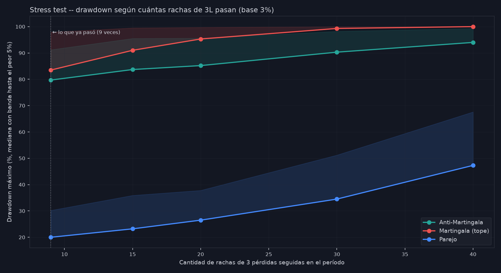

**El Parejo se degrada de forma gradual y sigue siendo mayormente positivo incluso en el peor escenario probado. La Martingala se rompe de forma abrupta — con solo 30 rachas de 3 (poco más del triple de lo real), el retorno mediano ya es negativo.**

---

## 5. La variante ganadora — "2 confirmaciones + incremento lineal"

### Cómo funciona

No sube el riesgo apenas ganás una operación — **espera a ver 2 ganancias seguidas primero**. Recién en la 3ª operación de esa racha (si sigue viva) empieza a subir, de a un porcentaje fijo por cada ganancia extra (no duplicando), con un techo definido de niveles. Ante cualquier pérdida, resetea de una a la base.

### Por qué funciona mejor que duplicar

Exigir 2 confirmaciones filtra el ruido de rachas cortas (la mayoría de las rachas ganadoras reales duran solo 1-2 operaciones), y subir de forma lineal (no duplicando) evita que el nivel más alto se vuelva peligroso.

### Comparación contra Parejo, grilla 1%-5% (incremento 1%/nivel)

| Base | Parejo | 2 confirmaciones |
|---|---|---|
| 1% | +437,0% / -4,5% | +2.439,1% / -8,8% |
| **3%** | +13.536,3% / -13,1% | +59.246,5% / -16,7% |
| 5% | +292.663,7% / -21,3% | +1.173.886,6% / -24,6% |

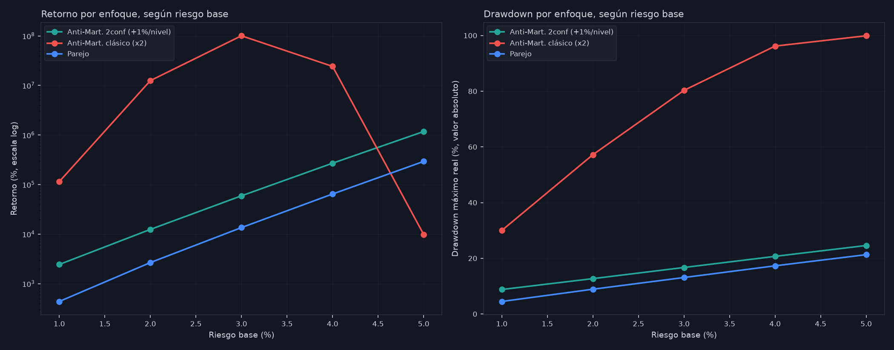

### ¿2 o 3 confirmaciones? — 2 gana

| Base | 2 confirmaciones | 3 confirmaciones |
|---|---|---|
| 3% | +59.246,5% / -16,7% | +35.825,4% / -15,8% |

Pedir una confirmación extra resigna casi 40% del retorno por apenas 1 punto menos de drawdown — no vale la pena.

### Stress test de la variante ganadora — aguanta mejor que Parejo bajo peor suerte

| Rachas de 3L | Parejo | 2 confirmaciones | 3 confirmaciones |
|---|---|---|---|
| 9 (real) | +4.906,6% / -21,5% / 100% | +15.950,0% / -23,8% / 100% | +10.009,0% / -22,7% / 100% |
| **40** | +63,8% / -46,6% / 83,3% | **+149,6% / -49,6% / 92,3%** | +99,4% / -48,6% / 87,7% |

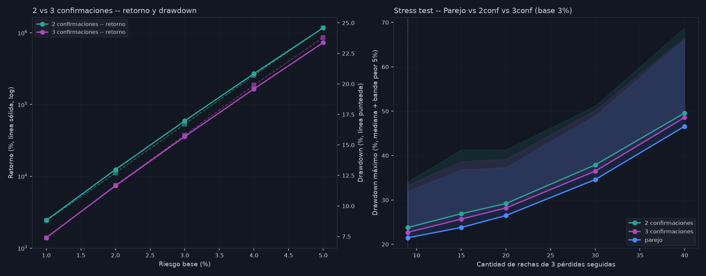

**2 confirmaciones no solo rinde más — en el escenario de peor suerte, también termina en positivo con más frecuencia que el Parejo (92,3% vs 83,3%).**

---

## 6. ¿Todos los días, o solo los mejores? — se repite el mismo patrón

Aplicando "2 confirmaciones" solo a Martes/Miércoles/Jueves (los días con mejor Win Rate, 306 de 482 operaciones) vs. todos los días:

| Base | Todos los días | Solo Mar/Mié/Jue |
|---|---|---|
| **3%** | +59.246,5% / -16,7% | +9.192,5% / -13,3% |

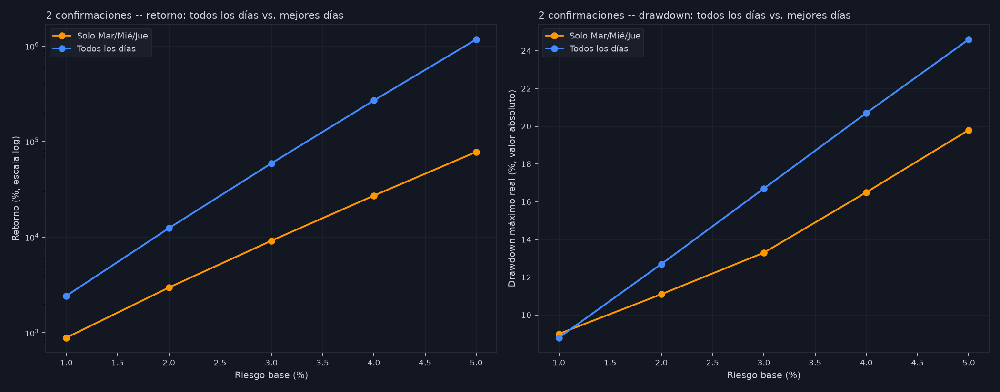

Restringirse a los mejores días resigna 6,4 veces el retorno por solo 3,4 puntos menos de drawdown — la misma conclusión que ya habíamos encontrado con el riesgo parejo ponderado por día: diversificar sobre TODOS los días operables aprovecha mejor el edge real, porque todos tienen ventaja positiva, no solo Miércoles.

---

## 7. Combinado con la Gestión Híbrida (los parámetros de Fabian) y grilla de modos

| Base | Gestión Híbrida + Parejo | Gestión Híbrida + 2 confirmaciones |
|---|---|---|
| 3% | +615,1% / -16,0% | +1.480,4% / -19,5% |
| 5% | +2.371,9% / -25,9% | +5.178,7% / -29,0% |

Meterle 2 confirmaciones a la Gestión Híbrida más que duplica el retorno con solo 3-4 puntos más de drawdown.

**Grilla 2x2 — {1, 2} confirmaciones × {lineal, doblando}:**

| | 1 conf. / lineal | 1 conf. / doblando | 2 conf. / lineal | 2 conf. / doblando |
|---|---|---|---|---|
| Base 3% | +129.895,2% / -19,4% | +100.378.900,2% / -80,3% | +59.246,5% / -16,7% | +4.821.558,2% / -75,2% |

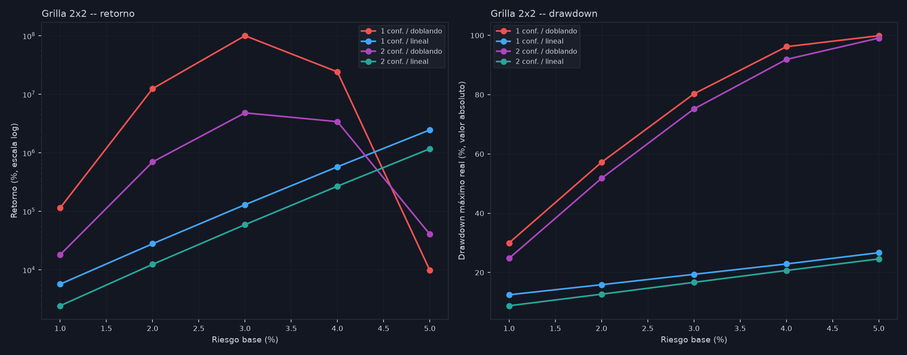

Los dos modos "doblando" quedan descartados (drawdown de -75% a -99,9%) — el incremento lineal es lo que hace segura a toda esta familia de estrategias.

---

## 8. Afinando el tamaño del paso

| Paso 1ra confirmación | Paso 2da confirmación | Retorno (base 3%) | Drawdown |
|---|---|---|---|
| 1% | 1% | +68.508,9% | -17,7% |
| 1% | 3% | +231.002,3% | -22,4% |
| 2% | 1% | +175.419,9% | -22,3% |
| **2%** | **3%** | **+571.520,8%** | **-26,4%** |

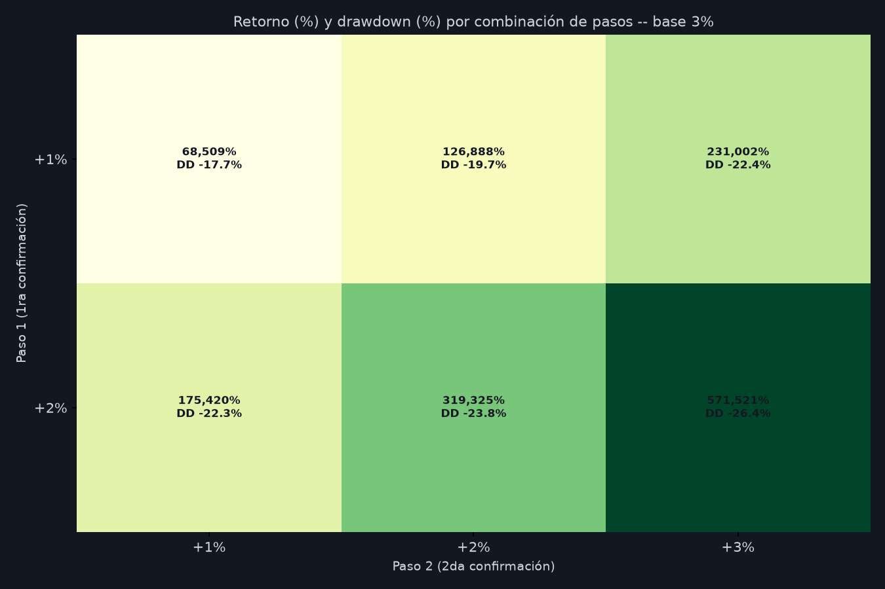

Y extendiendo el incremento por nivel a 1%, 2%, 3% y 4% (base 3%, todos los días):

| Incremento | Retorno | Drawdown |
|---|---|---|
| 1% | +59.246,5% | -16,7% |
| **2%** | **+228.059,5%** | **-20,8%** |
| 3% | +775.751,4% | -25,2% |
| 4% | +2.334.275,8% | -29,5% |

**2% de incremento por nivel es el punto donde la mejora sigue siendo "barata"** (relación retorno/drawdown todavía muy favorable) — 3-4% ya empieza a acercarse a la zona límite.

---

## 9. Un chequeo honesto — ¿hay "mano caliente" real?

Antes de cerrar, se testeó si ganar una operación realmente predice que la siguiente también gane (lo que justificaría matemáticamente escalar en rachas):

- P(ganar) sin condicionar: 66,9%
- P(ganar | la anterior fue ganadora): 68,0%
- P(ganar | la anterior fue perdedora): 64,5%
- Diferencia: 3,5 puntos — **test de significancia: p=0,461, NO significativo**

**No hay mano caliente real en el historial de Fabian — ganar y perder son estadísticamente casi independientes, operación a operación.** Esto no invalida la mejora que encontramos con "2 confirmaciones": esa mejora viene de gestión de posición inteligente (apostar más cuando el azar ya te dio una racha, que va a pasar con cierta frecuencia de todos modos), no de haber descubierto que las rachas se auto-predicen. El edge real y estudiado está en el criterio de entrada de Fabian (66,9% de Win Rate vs. 50% de una moneda), no en el momentum de las rachas.

---

## 10. Estrategia final recomendada — base 3% y base 5%, comparadas

**Configuración**: 2 confirmaciones, incremento lineal 2% por nivel, aplicado a TODOS los días que opera Fabian (no solo los mejores), USD 1.000 iniciales.

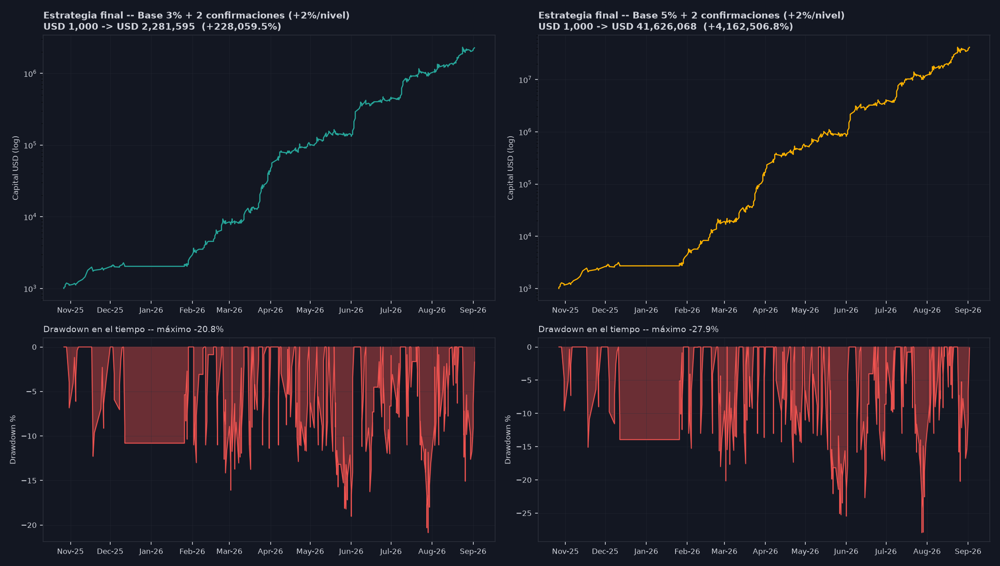

| | Base 3% | Base 5% |
|---|---|---|
| Capital final | USD 2.281.595 | USD 41.626.068 |
| Retorno | +228.059,5% | +4.162.506,8% |
| Drawdown real | -20,8% | -27,9% |
| Drawdown peor 5% (bootstrap) | -29,8% | -40,6% |
| P(terminar en ganancia) | 100% | 100% |

**Comparación directa**: base 5% da 18 veces más retorno que base 3%, a cambio de 7 puntos más de drawdown real (y 11 puntos más en el peor escenario del bootstrap). Ninguna de las dos tiene riesgo de ruina medido en los 5.000 universos simulados — la diferencia entre ambas es pura intensidad, no un cambio de naturaleza del riesgo.

---

## 11. Conclusión final

1. **La Martingala que propuso Fabian se descarta** — tiene un riesgo de ruina real y creciente (hasta 26,9% de perder todo en el perfil agresivo) porque apuesta más justo cuando el mercado viene en contra. Bajo estrés (más rachas de pérdidas de lo normal), colapsa de forma abrupta.
2. **El Anti-Martingala clásico (duplicar en rachas ganadoras) mejora mucho la seguridad, pero solo en bases bajas** — en bases más altas también desarrolla drawdowns severos, por una razón distinta (una pérdida grande justo después de una racha caliente).
3. **La mejor combinación encontrada es "2 confirmaciones + incremento lineal"**: espera 2 ganancias antes de subir, sube de a puntos fijos (no duplicando), resetea ante cualquier pérdida. Le gana al riesgo parejo en TODOS los escenarios probados — histórico real, bootstrap de probabilidad, y estrés de rachas más frecuentes — con un costo de drawdown moderado y controlado.
4. **Aplicarla a TODOS los días que opera Fabian, no solo a los mejores** (Miércoles/Martes/Jueves) — restringir días resigna mucho más retorno del que protege, porque todos los días tienen edge positivo.
5. **El incremento recomendado es 2% por nivel** — más que eso empieza a acercarse a la zona donde el drawdown extra ya no se paga con suficiente retorno adicional.
6. **Entre base 3% y base 5%**: ambas están libres de riesgo de ruina medido; la elección entre una y otra es una decisión de cuánta intensidad de crecimiento se busca, no de seguridad — 5% da mucho más crecimiento a cambio de un drawdown más profundo pero todavía dentro de lo que el sistema demostró poder sostener.

Este es el resultado de someter la idea original de Fabian a la prueba más exhaustiva posible con los datos reales — se descartó lo que no funcionaba, se entendió por qué, y se construyó algo mejor a partir de esa misma lógica de escalar el riesgo en rachas.

---

## Anexo — trazabilidad completa

Todos los scripts en `jarvis/trading_algoritmico/fabian_manual_strategy/otras_sesiones/`:
`escalera_de_riesgo_martingala.py`, `escalera_martingala_visual.py`, `escalera_nivel_por_nivel_y_antimartingala.py`, `comparacion_3_enfoques_1a5.py`, `stress_test_rachas_y_mitigacion.py`, `antimartingala_2confirmaciones.py`, `confirmaciones_stress_y_3conf.py`, `2conf_mejores_dias_vs_todos.py`, `hibrida_2conf_y_grilla_confirmaciones.py`, `grilla_pasos_y_patron_rachas.py`, `estrategia_final_3_y_5.py`. Todos los CSVs de resultados están en la misma carpeta.
