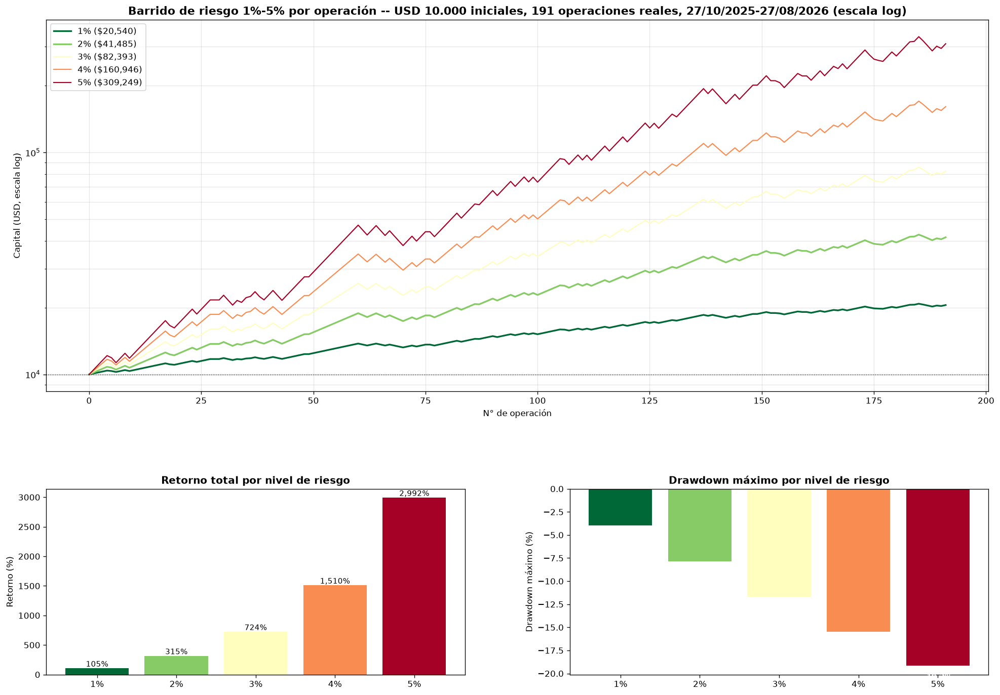
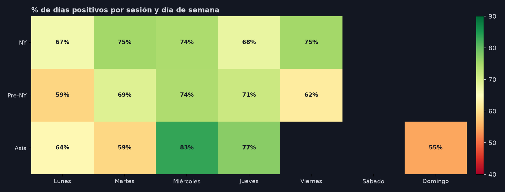
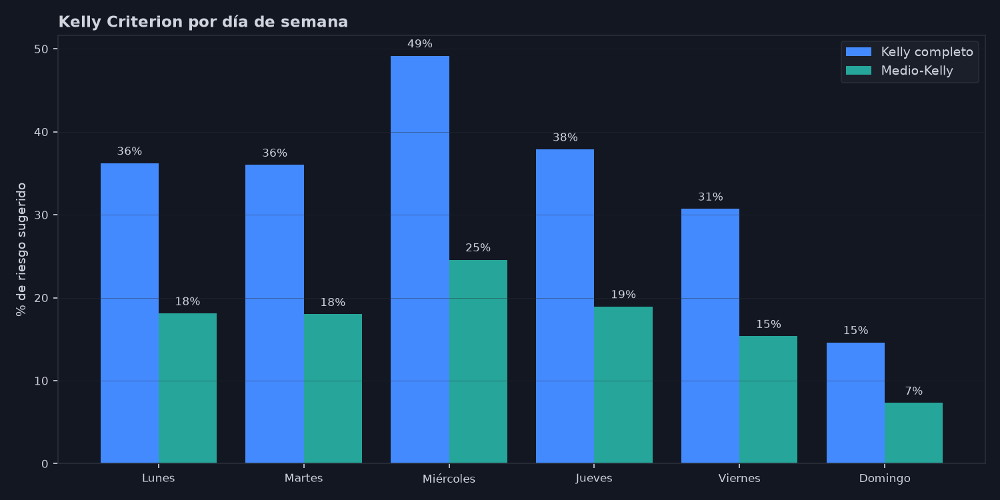
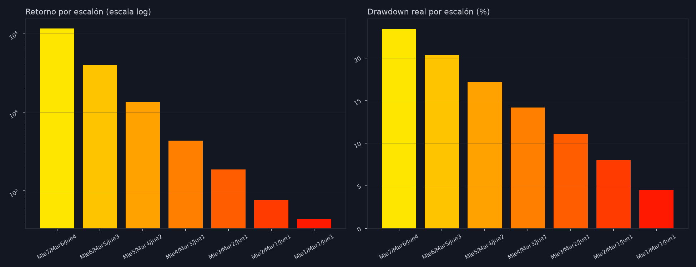
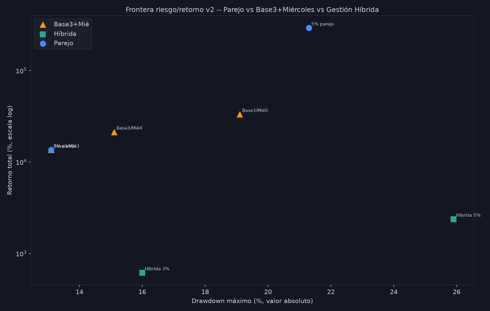
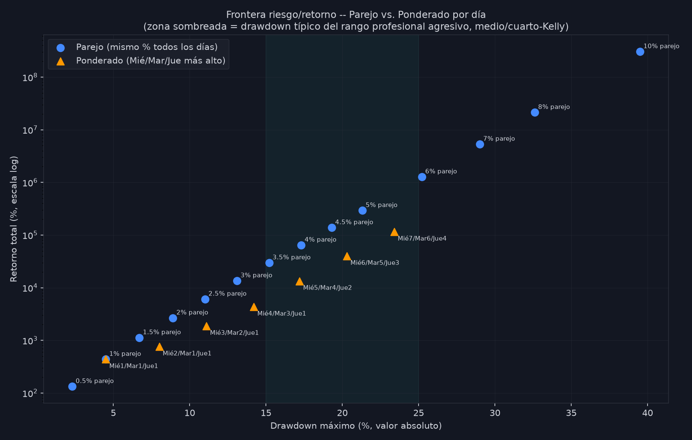
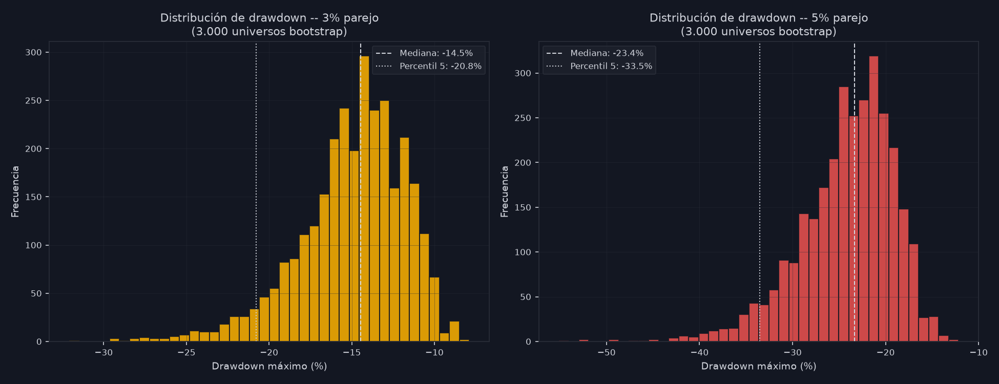
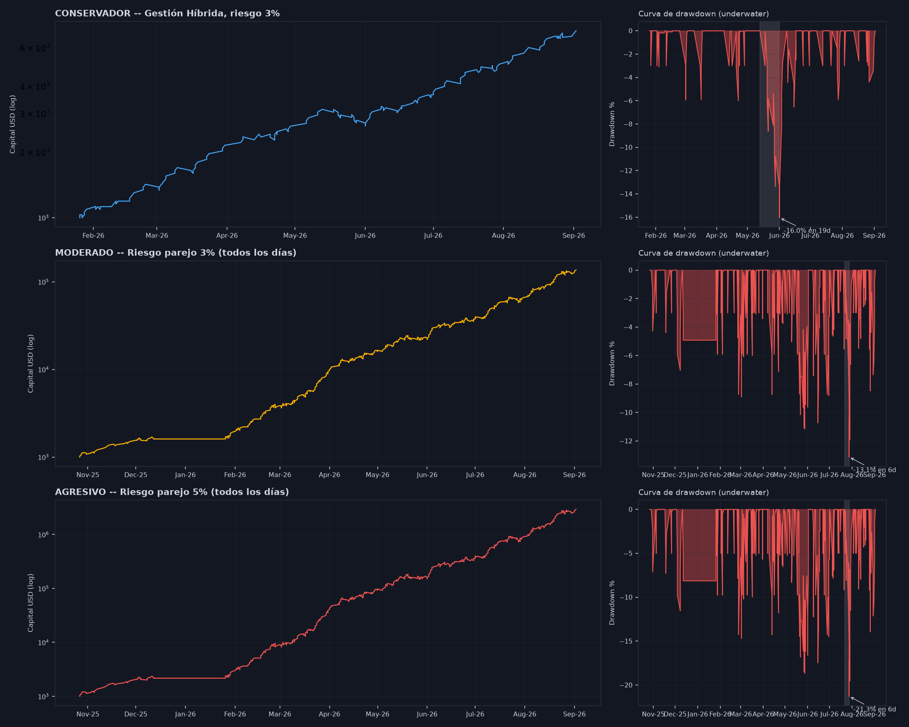

# Informe de Gestión de Riesgo — Estrategia XAU/USD de Fabian

**Fecha:** 02/09/2026
**Alcance:** desde el barrido de riesgo original (27-30/08/2026) hasta los 3 perfiles de inversor finales (Conservador / Moderado / Agresivo), pasando por el hallazgo del patrón de día de semana, la gestión híbrida y la frontera riesgo/retorno.
**Base de datos:** 482 operaciones reales de Fabian (NY: 191, Pre-NY: 145, Asia: 146), 27/10/2025 → 02/09/2026 (~10,2 meses).

---

## 0. Resumen ejecutivo

Partiendo de las 482 operaciones reales que Fabian efectivamente tomó (no señales del código, no simulación — su historial real, día por día, en las 3 sesiones que opera), este informe documenta todo el proceso de búsqueda del mejor esquema de gestión de riesgo: desde el primer barrido simple (1%-5% parejo) hasta un mapeo completo comparando **riesgo parejo**, **riesgo ponderado por día de semana** y una **gestión híbrida** (días limitados + tope semanal + corte diario), verificado contra benchmarks profesionales reales (FTMO, Kelly Criterion) y contra las condiciones del broker (MultiBank).

**El hallazgo central**: a igual nivel de drawdown, aplicar el mismo riesgo TODOS los días le gana, de forma consistente y por márgenes de 3x a 10x en retorno acumulado, a concentrar el riesgo solo en el mejor día (Miércoles). El patrón de Miércoles es real y significativo estadísticamente en las 3 sesiones — pero la forma correcta de aprovecharlo no es concentrar ahí todo el riesgo, es no resignar el edge que también tienen los demás días.

**Los 3 perfiles finales** (Conservador = Gestión Híbrida 3%, Moderado = 3% parejo, Agresivo = 5% parejo) están documentados con curva de capital, curva de drawdown en el tiempo, y el detalle de TODOS los episodios de caída (no solo el peor), para que la decisión de cuánto riesgo tomar se haga con el panorama completo, no con un solo número.

---

## 1. Punto de partida — los datos reales de Fabian

| Sesión | Operaciones | Win Rate | R total | Drawdown en R | Período |
|---|---|---|---|---|---|
| New York (09:02-11:00 NY) | 191 | 65,4% | +72,8R | -4,0R | 27/10/2025 → 27/08/2026 |
| Pre New York (07:00-09:00 NY) | 145 | 65,7% | +47,2R | -7,4R | 26/01/2026 → 02/09/2026 |
| Asia (20:02-22:00 NY) | 146 | 67,2% | +51,2R | -3,5R | 26/01/2026 → 01/09/2026 |
| **Combinado (las 3)** | **482** | **~66%** | **+170,2R** | — | 27/10/2025 → 02/09/2026 |

Estos son los datos que ya habíamos validado en la fase de calibración (código vs. Fabian, 95,3% de coincidencia exacta en NY) — acá se usan tal cual los operó Fabian, sin pasar por el motor mecánico, porque el objetivo de este tramo del trabajo no es "¿el código reconoce lo mismo que Fabian?" sino "¿cómo gestionamos el riesgo sobre lo que Fabian ya demostró que funciona?".

Asia es la sesión con el drawdown histórico más chico (-3,5R); Pre-NY es la más castigada de las 3 (-7,4R) — dato relevante para cualquier decisión de asignar más o menos peso a una sesión en particular.

---

## 2. Tramo 1 — El barrido de riesgo original (parejo, 1%-5%)

Primer escenario, sobre las 191 operaciones de NY únicamente, USD 10.000 iniciales, interés compuesto:

| Riesgo | Capital final | Retorno | Drawdown máximo |
|---|---|---|---|
| 1% | USD 20.540 | +105,4% | -4,0% |
| 2% | USD 41.485 | +314,8% | -7,9% |
| 3% | USD 82.393 | +723,9% | -11,7% |
| 4% | USD 160.946 | +1.509,5% | -15,5% |
| 5% | USD 309.249 | +2.992,5% | -19,2% |

Este fue el punto de partida — pero usaba solo NY y no distinguía entre días de la semana. El resto del informe expande esto a las 3 sesiones combinadas y busca dónde hay margen para mejorar sin asumir más riesgo del necesario.

---

## 3. Tramo 2 — El hallazgo del patrón de día de semana

Se agrupó cada día calendario (sumando el R de todas las operaciones de ese día, en cualquier sesión) y se clasificó como positivo/negativo. Resultado combinando las 3 sesiones:

| Día | Días operados | % Positivo | R total | R promedio/día |
|---|---|---|---|---|
| Lunes | 37 | 70,3% | +29,9R | +0,809 |
| Martes | 38 | 73,7% | +38,5R | +1,014 |
| **Miércoles** | 39 | **82,1%** | **+48,3R** | **+1,240** |
| Jueves | 34 | 76,5% | +33,3R | +0,981 |
| Viernes | 30 | 63,3% | +16,3R | +0,543 |
| Domingo (madrugada Asia) | 22 | 54,5% | +3,8R | +0,173 |

**Miércoles se repite como el mejor día en las 3 sesiones evaluadas por separado** (NY 74,2%, Pre-NY 74,1%, Asia 83,3%) — la consistencia entre 3 muestras independientes es una señal más fuerte que cualquier test individual, aunque ningún test cruza formalmente p<0,05 con bootstrap (la muestra por día de semana, ~30-40 casos, es chica).

**Kelly Criterion por día** (calculado a nivel de operación individual, no de día):

| Día | N operaciones | Win Rate | Kelly completo | Medio-Kelly |
|---|---|---|---|---|
| Lunes | 92 | 67,1% | 36,2% | 18,1% |
| Martes | 112 | 65,4% | 36,0% | 18,0% |
| **Miércoles** | 104 | **74,0%** | **49,2%** | **24,6%** |
| Jueves | 90 | 67,0% | 37,9% | 18,9% |
| Viernes | 55 | 62,3% | 30,7% | 15,4% |
| Domingo | 29 | 53,8% | 14,6% | 7,3% |

Miércoles tiene el mejor Win Rate y el Kelly más alto de la semana — matemáticamente confirma el patrón encontrado por conteo simple.

**Probabilidad de terminar en ganancia operando todos los Miércoles** (bootstrap por bloques de día, 5.000 universos simulados):

| Riesgo | P(termina en ganancia) | Drawdown mediana | Drawdown peor 5% |
|---|---|---|---|
| 10% | 100,0%* | -27,1% | -39,2% |
| 15% | 100,0%* | -38,5% | -54,5% |
| 20% | 100,0%* | -48,8% | -67,0% |

*ninguno de los 5.000 universos simulados terminó en pérdida — no es "imposible perder", es "no observado en 5.000 corridas". El edge es fuerte, pero el camino hacia ese resultado casi siempre atraviesa una caída severa.

---

## 4. Tramo 3 — Escenarios de riesgo variable por día (la escalera de descenso)

Primer intento de aprovechar el patrón: subir el riesgo específicamente los días más fuertes. Punto de partida: Miércoles 15% / resto 3% — drawdown -52% (excesivo). Se armó una escalera bajando de a 1 punto porcentual hasta encontrar un balance razonable:

| Miércoles | Retorno | Drawdown | Peor racha (3L) | Peor día único |
|---|---|---|---|---|
| 15% | +167.043,8% | -57,7% | -32,7% | -29,4% |
| 10% | +26.209,4% | -40,9% | -22,7% | -19,8% |
| **7%** | +7.703,3% | -28,7% | -16,3% | -13,9% |
| 5% | +3.217,8% | -20,0% | -11,8% | -10,0% |

Con Miércoles fijado en 7% (drawdown <30%, peor día único <15% — el punto donde ambas precauciones todavía se sostienen), se probó subir Martes y Jueves también:

- **Martes**: subir el riesgo ahí no solo no empeora el drawdown, lo MEJORA (-28,7% → -21,7% al subir de 1% a 8%) — porque Martes tiene edge positivo y compone capital más rápido antes de que llegue el peor golpe (que viene de Miércoles), así el mismo dólar de pérdida pesa menos sobre una base más grande.
- **Jueves**: más neutral, estable hasta 6%; en 7% aparece un nuevo "peor día" (26/02/2026) que indica que ahí es donde el riesgo empieza a no compensarse.

**Combinación resultante: Miércoles 7% / Martes 6% / Jueves 4% / resto 1%** — drawdown real -23,4%, bootstrap: 100% de 5.000 universos terminan en ganancia, solo 5,8% de probabilidad de drawdown peor que -30%.

**Escalera completa de descenso** (para comparar más adelante):

| Combinación | Retorno | Drawdown real | P(positivo) bootstrap | P(DD peor que -30%) |
|---|---|---|---|---|
| Mié7/Mar6/Jue4 | +115.285,0% | -23,4% | 100,0% | 5,7% |
| Mié6/Mar5/Jue3 | +39.892,0% | -20,3% | 100,0% | 1,4% |
| Mié5/Mar4/Jue2 | +13.395,1% | -17,2% | 100,0% | 0,1% |
| Mié4/Mar3/Jue1 | +4.332,7% | -14,2% | 100,0% | 0,0% |
| Mié3/Mar2/Jue1 | +1.869,6% | -11,1% | 100,0% | 0,0% |
| Mié2/Mar1/Jue1 | +758,6% | -8,0% | 100,0% | 0,0% |
| Mié1/Mar1/Jue1 (parejo, piso) | +437,0% | -4,5% | 100,0% | 0,0% |

---

## 5. Tramo 4 — Gestión híbrida (parámetros de Fabian)

Fabian aportó un esquema de gestión propio para optimizar Pre-NY + Asia:

1. **Días operativos limitados**: Pre-NY solo Lunes-Jueves; Asia solo Lunes, Miércoles y Jueves.
2. **Tope semanal de ganancia +3R** combinado entre ambas sesiones — al alcanzarlo, se frena toda la operativa el resto de esa semana.
3. **Sin límite semanal de pérdida.**
4. **Corte diario en el primer TP o el segundo SL** de cada sesión (los "3 escenarios diarios" que describió: 1 TP / 1 SL+1 TP / 2 SL, son las 3 formas posibles en que puede terminar un día bajo esta regla).

**Resultado de aplicar esto sobre los datos crudos**: de 291 operaciones (Pre-NY + Asia) se pasa a **160 operaciones**, con **71,7% Win Rate y +67,7R** en 32 semanas — 18 de esas 32 semanas (56%) llegaron al tope de +3R, así que la regla de corte funciona seguido, no es un caso raro.

| Riesgo (uniforme) | Retorno | Drawdown | P(DD peor que -20%) | P(DD peor que -30%) |
|---|---|---|---|---|
| 2% | +276,5% | -10,9% | 0,1% | 0,0% |
| **3%** | +615,1% | -16,0% | 1,0% | 0,0% |
| **4%** | +1.238,9% | -21,0% | 6,5% | 0,1% |
| 5% | +2.371,9% | -25,9% | 20,6% | 1,5% |
| 6% | +4.400,3% | -30,5% | 45,4% | 4,3% |

La Gestión Híbrida es, de todos los esquemas probados, la de perfil de cola más controlado — al costo de operar mucho menos (menos volumen = menos compounding = menos retorno absoluto al mismo riesgo nominal).

---

## 6. Tramo 5 — La frontera riesgo/retorno (el hallazgo central del informe)

Se comparó, al MISMO nivel de drawdown, riesgo parejo vs. riesgo ponderado por día vs. gestión híbrida:

| Drawdown similar | Parejo | Ponderado (Mié/Mar/Jue) | Híbrida |
|---|---|---|---|
| ~13-16% | 3% → **+13.536,3%** | Mié4/Mar3/Jue1 → +4.332,7% | 3% → +615,1% |
| ~20-21% | 5% → **+292.663,7%** | Mié6/Mar5/Jue3 → +39.892,0% | 4% → +1.238,9% |

**En todos los cortes, el riesgo parejo rinde entre 3x y 20x más que las alternativas concentradas o restringidas, al mismo drawdown.** La razón es la misma en ambos casos: Miércoles es el mejor día, pero Lunes/Martes/Jueves/Viernes también tienen edge positivo (65-67% de Win Rate cada uno) — concentrar el riesgo en un solo día, o restringir los días operables, resigna parte del edge real que existe el resto de la semana.

**Tabla completa — riesgo parejo, de 0,5% a 10%:**

| Riesgo | Retorno | Drawdown real | P(DD peor que -20%) | P(DD peor que -30%) |
|---|---|---|---|---|
| 1% | +437,0% | -4,5% | 0,0% | 0,0% |
| 2% | +2.663,9% | -8,9% | 0,1% | 0,0% |
| 2,5% | +6.071,6% | -11,0% | 1,9% | 0,0% |
| **3%** | +13.536,3% | -13,1% | 8,4% | 0,1% |
| 3,5% | +29.715,7% | -15,2% | 21,0% | 0,9% |
| 4% | +64.414,0% | -17,3% | 41,7% | 2,8% |
| 4,5% | +138.046,6% | -19,3% | 60,5% | 4,9% |
| **5%** | +292.663,7% | -21,3% | 78,6% | 11,4% |
| 6% | +1.274.565,3% | -25,2% | 97,5% | 34,0% |
| 7% | +5.325.772,4% | -29,0% | 99,6% | 62,0% |
| 8% | +21.359.376,6% | -32,6% | 100,0% | 83,7% |
| 10% | +304.028.097,2% | -39,5% | 100,0% | 98,7% |

---

## 7. Benchmark contra fuentes profesionales

Para no elegir un nivel de riesgo en el vacío, se comparó contra literatura y prácticas reales del sector:

- **Estándar de la industria: 1-2% de riesgo por operación.** *"Most experienced prop traders risk between 0.5% and 1% per trade"* ([QuantVPS](https://www.quantvps.com/blog/trading-risk-management), [Tradeciety](https://tradeciety.com/professional-position-sizing)).
- **FTMO** (la firma de fondeo más reconocida del sector) recomienda explícitamente **1-1,5% por operación**, con límite de pérdida diaria del 5% y 10% de pérdida total antes de perder la cuenta ([FTMO](https://ftmo.com/en/blog/how-much-should-you-risk-on-one-trade/), [FTMO Academy](https://academy.ftmo.com/lesson/maximum-daily-loss/)).
- **Kelly Criterion**: casi nadie lo usa completo en la práctica — el estándar profesional es medio-Kelly o cuarto-Kelly, que en la mayoría de estrategias reales cae en **2,5%-5%** ([QuantVPS](https://www.quantvps.com/blog/trading-risk-management)).

**Traducción a nuestros números**: el rango "profesional agresivo" (2,5%-5%) equivale, en esta estrategia, a un drawdown real de -11% a -21,3%. Dentro de esa franja hay un quiebre claro: hasta 3% la probabilidad de romper -20% de drawdown es baja (8,4%); de 4% en adelante ya es una moneda al aire (41,7%) o peor. **3% parejo es donde "lo que hacen los profesionales agresivos" y "lo que dicen los datos reales de Fabian" coinciden**; 5% parejo es el techo defendible dentro de ese mismo marco — pasado eso, ninguna fuente seria lo respalda.

Estos histogramas muestran el rango completo de resultados posibles (3.000 universos simulados por columna), no solo el peor caso puntual — a 3% la masa de la distribución está concentrada y lejos de -20%; a 5% la cola se estira mucho más hacia caídas profundas, aunque la mediana siga siendo manejable.

---

## 8. El broker — MultiBank

- **Regulación**: 17+ licencias globales (ASIC, CySEC, SCA, MAS), pero con nivel de protección variable según la entidad regional. Hay banderas puntuales: advertencia del regulador japonés (FSA) por operar sin autorización ahí, y señalamientos de los reguladores de España (CNMV) y Francia (AMF) ([WikiFX](https://www.wikifx.com/en/dealer/0001326398.html)).
- **Reputación mixta**: 4,7/5 en Trustpilot, pero más de 617 reclamos recientes en WikiFX, mayormente por fondos bloqueados y retiros denegados ([WikiFX](https://www.wikifx.com/en/newsdetail/202603114694188575.html)).
- **Restricción de scalping — accionable**: MultiBank define scalping como abrir/cerrar en menos de 120 segundos y limita esto **solo en cuentas ECN**; las cuentas **Pro y Standard no tienen esa restricción** ([condiciones oficiales](https://multibank.link/en/tools/trading-conditions)). Dado que esta estrategia cierra posiciones en minutos, **la cuenta debe ser Pro o Standard, nunca ECN**.
- **"Pasar desapercibido"**: lo que hace que un broker banee a un trader rentable no es "ganar mucho", es que la ganancia dependa de explotar la infraestructura propia del broker (latencia, precios stale) en vez de una lectura genuina del mercado. Esta estrategia se basa en estructura de mercado real (M3, ChoC, patrones de vela) — no encaja en ese perfil de riesgo para el broker.

---

## 9. Los 3 perfiles finales

| Perfil | Esquema | Retorno (desde USD 1.000) | Drawdown máximo | Peor tramo (profundidad / duración) |
|---|---|---|---|---|
| **Conservador** | Gestión Híbrida, riesgo 3% | USD 7.151 (+615,1%) | -16,0% | -16,0% en 19 días (13/05 → 01/06/2026) |
| **Moderado** | Riesgo parejo 3%, todos los días | USD 136.363 (+13.536,3%) | -13,1% | -13,1% en 6 días (22/07 → 28/07/2026) |
| **Agresivo** | Riesgo parejo 5%, todos los días | USD 2.927.637 (+292.663,7%) | -21,3% | -21,3% en 6 días (22/07 → 28/07/2026) |

**Hallazgo sobre "los momentos"**: Moderado y Agresivo comparten exactamente el mismo peor momento (22-28/07/2026) porque usan la misma serie de operaciones — fue un golpe **rápido y agudo, 6 días**. El Conservador tuvo su peor momento en un tramo **más largo pero menos profundo** (19 días, mayo-junio) — cambia el TIPO de dolor, no solo la magnitud: menos profundo pero más largo de sobrellevar.

### Todos los drawdowns (no solo el peor)

| Perfil | Episodios de drawdown (>1%) | ≥5% de profundidad | ≥10% de profundidad | Días de recuperación (mediana / máximo) |
|---|---|---|---|---|
| Conservador | 22 | 6 | 1 | 1 / 7 |
| Moderado | 59 | 22 | 3 | 1 / 45 |
| Agresivo | 59 | 51 | 12 | 1 / 45 |

La gran mayoría de los episodios, en los 3 perfiles, se recuperan en 0-3 días — son ruido normal de la operativa, no crisis. El Conservador tiene 3x menos episodios totales que Moderado/Agresivo (por el menor volumen de operaciones de la Gestión Híbrida), y proporcionalmente muchos menos que llegan a profundidades serias (solo 1 de 22 supera el 10%, contra 3 y 12 respectivamente en Moderado/Agresivo).

### Los 3 perfiles con distintos capitales iniciales

El % de retorno y de drawdown es idéntico sin importar el capital de partida (el modelo compone sobre el capital actual, `capital += capital × riesgo × R`) — lo único que cambia es la escala del monto final:

| Perfil | USD 1.000 | USD 2.000 | USD 5.000 |
|---|---|---|---|
| Conservador (Híbrida 3%) | USD 7.151 | USD 14.302 | USD 35.755 |
| Moderado (3% parejo) | USD 136.363 | USD 272.726 | USD 681.815 |
| Agresivo (5% parejo) | USD 2.927.637 | USD 5.855.274 | USD 14.638.185 |

El drawdown en dólares sí cambia con la escala: con Agresivo (-21,3%), la peor caída representa -USD 213 sobre 1.000, -USD 426 sobre 2.000, o -USD 1.065 sobre 5.000 — la exposición real crece proporcional al capital, aunque el % sea el mismo.

---

## 10. Hallazgos interesantes (resumen aparte)

1. **Miércoles es real y consistente en 3 sesiones independientes** (NY, Pre-NY, Asia) — el mejor día de la semana, con el Kelly más alto (49,2% completo / 24,6% medio).
2. **Pero concentrar riesgo en el mejor día pierde contra diversificar riesgo parejo** — a igual drawdown, parejo rinde 3x-20x más que cualquier esquema ponderado, porque todos los días (menos el tramo dominical de Asia) tienen edge positivo.
3. **Subir el riesgo en un día con edge positivo puede REDUCIR el drawdown máximo**, no solo el retorno — efecto de timing del compounding (el capital crece más rápido antes de la peor racha, así el mismo golpe en dólares pesa menos en %). Confirmado con Martes en el tramo 3.
4. **La probabilidad de terminar en pérdida, en cualquiera de los esquemas probados con suficiente volumen de operaciones, es prácticamente cero** (0/5.000 universos bootstrap) — el riesgo real no es "perder al final", es la profundidad y duración del camino.
5. **Moderado y Agresivo comparten el mismo peor momento histórico** (22-28/07/2026) — la diferencia entre ambos no es "sufren en momentos distintos", es "el mismo momento pega más fuerte cuanto más riesgo".
6. **La Gestión Híbrida cambia el tipo de riesgo, no solo la magnitud**: menos operaciones, drawdowns más raros pero potencialmente más largos de digerir psicológicamente.
7. **3% parejo es, de todo lo mapeado, el punto donde el estándar profesional agresivo (medio-Kelly, FTMO) y los datos reales de Fabian coinciden** — no es una elección arbitraria, es donde converge la evidencia externa con la interna.

---

## 11. Conclusión y opciones de riesgo/beneficio

No hay un único "mejor" nivel de riesgo — hay un menú de opciones válidas, cada una con un trade-off distinto y ya cuantificado:

| Opción | Cuándo tiene sentido | Retorno | Drawdown | Riesgo de cola (P DD<-30%) |
|---|---|---|---|---|
| **Gestión Híbrida 3%** | Priorizar tranquilidad operativa, menos pantalla, drawdowns raros | +615,1% | -16,0% | 0,0% |
| **3% parejo** (recomendado como base) | El punto de convergencia entre estándar profesional y datos reales | +13.536,3% | -13,1% | 0,1% |
| **5% parejo** | Máximo aprovechamiento del edge, para quien no le teme al -20/-21% | +292.663,7% | -21,3% | 11,4% |
| Cualquier cosa por encima de 5-6% | Sin respaldo en ninguna fuente profesional consultada | — | -25% a -76% | 34% a 99% |

**Mi conclusión directa**: el riesgo parejo, aplicado a TODOS los días operables sin distinción, es matemáticamente superior a cualquier esquema de concentración o restricción que probamos — este es el hallazgo que más debería pesar en la decisión, más que elegir un % puntual. Dentro de eso, **3% es la base defendible** (coincide con lo que recomienda la industria y lo que sostienen los datos), y **5% es el techo razonable** para quien busca maximizar el crecimiento sin salirse del terreno que algún estándar profesional reconoce. Pasado el 5-6%, se entra en territorio que ninguna fuente seria — ni Kelly completo, ni FTMO, ni la práctica estándar del sector — recomienda, por más que el edge de Fabian sea real y bien documentado.

La decisión de capital real, tipo de cuenta y monto a operar queda en manos de Diego y Fabian — este informe da el mapa completo de opciones con su costo y beneficio medido, no una instrucción de inversión.

---

## Anexo — trazabilidad (scripts y datos fuente)

Todo lo de este informe es reproducible desde `jarvis/trading_algoritmico/fabian_manual_strategy/otras_sesiones/`:
- `consolidar_pre_ny_asia.py` — consolidación de los datos crudos de Pre-NY y Asia.
- `gestion_hibrida_pre_ny_asia.py` — simulación de la gestión híbrida.
- `patron_dia_semana.py` — análisis del patrón por día + bootstrap de significancia.
- `escenarios_riesgo_variable_dia.py` — motor de riesgo variable por día + Kelly.
- `grilla_riesgo_por_dia.py` — escalera de descenso de a 1 punto.
- `combinacion_final_7_6_4.py` — combinación final ponderada + bootstrap.
- `frontera_riesgo_retorno.py` / `frontera_v2_hibrida.py` — la frontera riesgo/retorno completa.
- `perfiles_equity_drawdown.py` — curvas de capital y drawdown de los 3 perfiles.
- `todos_los_drawdowns.py` — todos los episodios de drawdown, no solo el peor.
- `graficos_adicionales_informe.py` — heatmap de día de semana, histograma de bootstrap, barras de Kelly y de la escalera de descenso.

Todos los CSVs de resultados están en la misma carpeta, con el mismo nombre que el script que los genera + `_resumen.csv` o `_tabla.csv`.
