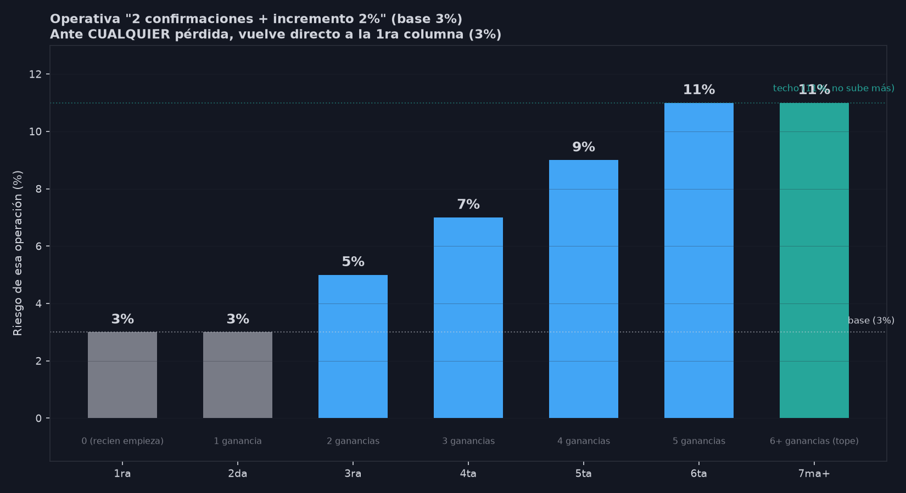

# Operativa día a día — "2 confirmaciones + incremento 2%" (Base 3%)

Referencia rápida de la gestión de riesgo final elegida (04/09/2026).
Para el análisis completo que la respalda, ver
`INFORME_ESCALERA_RIESGO_04SEP2026.md`.

## La regla, en una frase

**Las primeras 2 operaciones de cualquier racha van siempre al 3%. Recién
en la 3ra empieza a subir, de a 2 puntos por cada ganancia extra, con un
techo de 5 niveles. Ante cualquier pérdida, todo vuelve de una al 3%.**

## Tabla operativa

| Operación en la racha | Ganancias seguidas que llevás | Riesgo de ESA operación |
|---|---|---|
| 1ra | 0 (recién arrancás o venís de perder) | **3%** (base) |
| 2da | 1 ganancia | **3%** (todavía base — falta la 2da confirmación) |
| **3ra** | 2 ganancias seguidas | **5%** (sube por primera vez) |
| 4ta | 3 ganancias seguidas | **7%** |
| 5ta | 4 ganancias seguidas | **9%** |
| 6ta | 5 ganancias seguidas | **11%** |
| 7ma en adelante | 6, 7, 8... ganancias seguidas | **se queda en 11%** — no sigue subiendo |

## Los 4 puntos que hay que tener siempre presentes

1. **Se necesitan 2 ganancias confirmadas antes de tocar el riesgo** — nunca subís apenas ganás una sola operación.
2. **Sube de a 2 puntos por vez, nunca duplica** — esto es lo que evita el riesgo de ruina que sí tenía la Martingala original.
3. **Tiene techo: 5 niveles en total (3%, 3%, 5%, 7%, 9%, 11%)** — no sigue creciendo para siempre aunque la racha continúe.
4. **Una sola pérdida resetea todo a la base (3%)**, sin importar en qué nivel estabas.

## Por qué "todos los días" y no solo Miércoles/Martes/Jueves

Se probó restringir esta operativa solo a los 3 mejores días de la semana — rindió mucho menos (6,4 veces menos retorno) por apenas 3,4 puntos menos de drawdown. La conclusión: **aplicar esto a TODOS los días que Fabian realmente opera**, sin filtrar por día.
